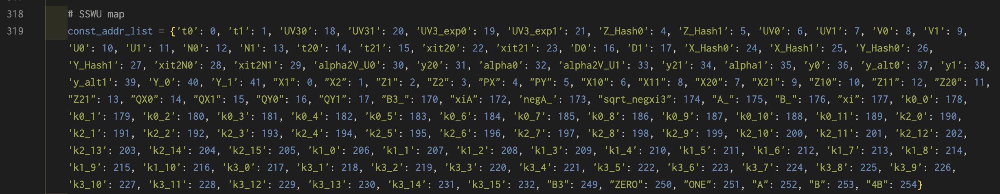

# How to use

## Prerequisite
- python version >= 3.10
- sagemath version >= 10.4
- scheduler: CPLEX

## Scheduling Automation
1. Enumerate the list of required operations in CSV file of `csv/` 

    exp: C=A*B > `C,A,B,MUL` 

    Supports MUL, ADD/SUB with flexible number of pipeline stages

2. Specify the scheduling target 
    
    input CSV name to the list of schedule.py L472

    exp: if you run scheduling with 2xSSWU_AFTER_EXP.csv
    

3. Generate pyschedule script & Run 

    ```shell
    $ python schedule.py -mn <number_of_MM> -ms <stages_of_MM> -an <number_of_MAS> -as <stages_of_MAS>
    ```
    **stages_of_XX** means the sum of input stage (1) + stages of operators

## Instruction Generation
1. Specify the main memory address list 

    specify the main memory address for the input/output valuemodify write_sequence.py L319
    

2. Run
    ```shell
    $ python write_sequence.py -mn <number_of_MM> -ms <stages_of_MM> -an <number_of_MAS> -as <stages_of_MAS> -n <algorithm_name>
    ```